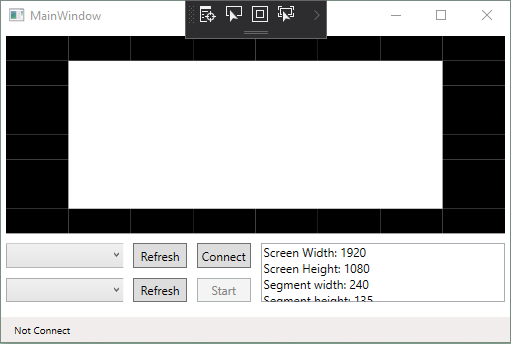

# Ambient Light

## Motivation

This project is built base on the Ambient Light TV from Phillips and also countless number of similar projects on the internet.

The video source is played on the laptop and transmitted to a TV via e.g. HDMI cable.

The main functionality of the Ambient Light system is analyzes the picture on the laptop screen (hence the TV screen), calculates the RGB (Red Green Blue) data of the picture, and sends the data to the controller so that it can process the RGB data and set the RGB led strip according to the data.

The outcome of the project is shown in this video

## Description

As mentioned in the Motivation part. The complete application consists of 2 parts:

### PC software

* The software running on the PC or Laptop is written in C# and using WPF as graphical user interface
* Basically this software:
  * Screenshot the laptop screen
  * Analyze the picture
  * Process the picture to get the RGB data out of it
  * Send the RGB value to the Arduino UNO via serial port
  * Repeat the step
  
### Arduino Firmware

* The firmware receives the data on the serial port and control the RGB strip according to the data
* The Driver for controlling the RGB strip is: Adafruit NeoPixel

## Requirement

* Arduino UNO
* WS2812b strip
* And the application

## How to build

* Flash the Firmware Amibient Light to your Arduino UNO
* Connect LED strip to pin 6 on the Arduino
* Make sure you provide enough power fo the LED strip
* Build the PC software (Visual Stuio required)
* Hook up the USB cable from the Arduino to your laptop
* On the PC software, looking for the COM port of the Arduino
* Press Connect then Start

## Folder strucure

* Doc: document, images
* Firmware_ambient_light: source code or the firmware on the arduino
* PC software: source code for the PC sofware

## Contact

For questions, suggestions, feedbacks please use Issue or drop me an email  at hainguyen.eeit@gmail.com
